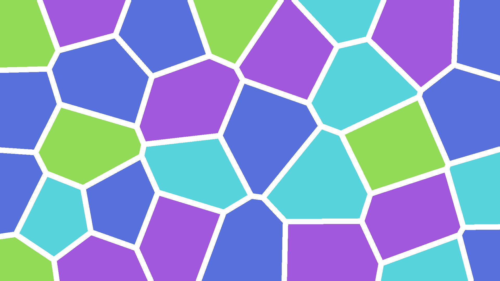

# Voronoi
A simple Python library for generating various kinds of Voronoi diagrams.

## Installation

To get the library (and its requirements), run:
```
git clone https://github.com/xiaoxiae/Voronoi.git
cd Voronoi
pip install -r requirements.txt
```

## Examples

```py
from voronoi import *

generate(
    path = "1.png",
    width = 3840,
    height = 2160,
    regions = 70,
    colors = [(0, 0, 0), (15, 15, 15), (23, 23, 23), (30, 30, 30)],
    color_algorithm = ColorAlgorithm.no_adjacent_same,
)
```


```py
from voronoi import *

generate(
    path = "2.png",
    regions = 30,
    colors = ["#91db57", "#57d3db", "#5770db", "#a157db"],
    border_size = 20,
)
```



```py
from voronoi import *

generate(
    path = "3.png",
    regions = 50,
    colors = ["#78c9b1", "#3eab71", "#27904d", "#006127"],
    distance_algorithm = DistanceAlgorithm.manhattan,
    color_algorithm = ColorAlgorithm.no_adjacent_same,
)
```


```py
from voronoi import *

generate(
    path = "4.png",
    regions = 50,
    colors = ["#1d63db", "#155ad0", "#0c4dbd", "#10459f"],
    distance_algorithm = DistanceAlgorithm.chebyshev,
    border_size = 20,
    border_color = "#093987",
    color_algorithm = ColorAlgorithm.no_adjacent_same,
)
```


```py
from voronoi import *

generate(
    path = "5.png",
    regions = 30,
    colors = ["#ffbec6", "#ffa4b4", "#ff7a92", "#ff5270", "#ff1e44"],
    distance_algorithm=DistanceAlgorithm.euclidean45degrees,
    color_algorithm = ColorAlgorithm.no_adjacent_same,
)
```


```py
from voronoi import *

generate(
    path = "6.png",
    regions = 20,
    distance_algorithm = [DistanceAlgorithm.manhattan, DistanceAlgorithm.euclidean],
    colors = ["#ff7b00", "#ff9500", "#ffb700", "#ffea00"],
    color_algorithm = ColorAlgorithm.no_adjacent_same,
    border_size = 10,
)
```


## `generate` function arguments
- `path`: the path (including an extension) to save the resulting file to
- `regions`: the number of distinct regions in the diagram
- `colors`: a list of tuples denoting the RGB of the color, or strings denoting the color in hex
- `width`: the width of the image; defaults to **1920**
- `height`: the height of the image; defaults to **1080**
- `region_algorithm`: the algorithm that determines the centers of the regions:
	- `RegionAlgorithm.uniform` attempts to make the centers equidistant to one another; **default**
	- `RegionAlgorithm.randomized` makes the center positions entirely random
- `distance_algorithm`: the algorithm that determines the way the distance is measured; if a list of the algorithms is provided, a random one is picked for each point
	- `DistanceAlgorithm.euclidean`: standard euclidean distance (hypotenuse); **default**
	- `DistanceAlgorithm.manhattan`: Manhattan (taxicab) distance (4 directions)
	- `DistanceAlgorithm.chebyshev`: Chebyshev distance (8 directions)
	- `DistanceAlgorithm.euclidean45degrees`: euclidean distance, but lines can only point in 45 degree increments
- `color_algorithm`: the algorithm that determines the colors of the regions
	- `DistanceAlgorithm.random`: pick the colors randomly
	- `DistanceAlgorithm.no_adjacent_same`: pick the colors such that no two adjacent regions have the same color
	- `DistanceAlgorithm.least_possible`: same as `no_adjacent_same`, but attempt to do so in the least number of colors
- `seed`: the seed for the random number generator; no seed by default
- `border_size`: the thickness of the border (in pixels); defaults to **0** (no border)
- `mask`: a path to an image mask so only specific areas are used
- `mask_color`: the color of the mask to fill, ignoring everything else; defaults to **`#000000`**
- `animate`: creates images in the folder `path` of the regions filling in; defaults to **False**
- `background`: background of the animation/masking/borders; defaults to **`#FFFFFF`**

