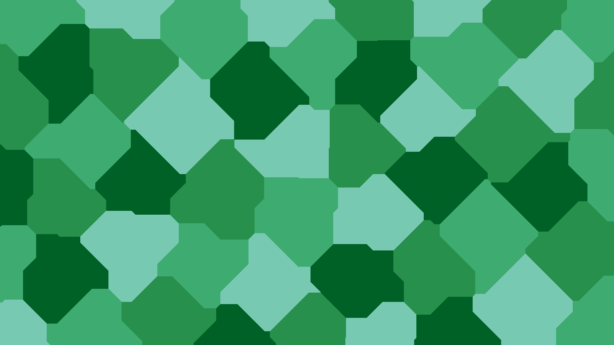
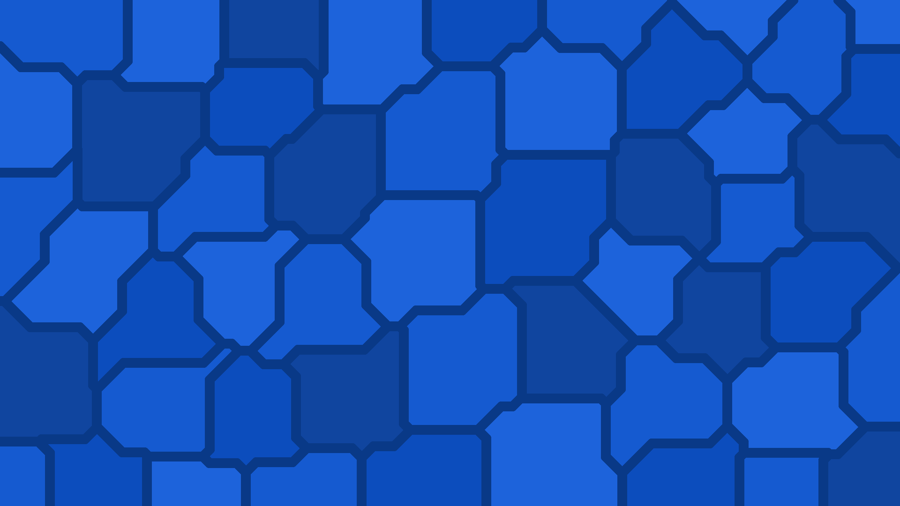

# Voronoi
A simple Python library for generationg various kinds of Voronoi diagrams.

To install, run:
```
git clone https://github.com/xiaoxiae/Voronoi.git
pip install -r requirements.txt
```

## Options
- `path`: the path (including an extension) to save the resulting file to
- `regions`: the number of distinct regions in the diagram
- `colors`: a list of tuples denoting the RGB of the color, or strings denoting the color in hex
- `width`: the width of the image; defaults to **1920**
- `height`: the height of the image; defaults to **1080**
- `region_algorithm`: the algorithm that determines the centers of the regions:
	- `RegionAlgorithm.uniform` attempts to make the centers equidistant to one another; **default**
	- `RegionAlgorithm.randomized` makes the center positions entirely random
- `distance_algorithm`: the algorithm that determines the way the distance is measured
	- `DistanceAlgorithm.euclidean`: standard euclidean distance (hypotenuse); **default**
	- `DistanceAlgorithm.manhattan`: Manhattan (taxicab) distance (4 directions)
	- `DistanceAlgorithm.chebyshev`: Chebyshev distance (8 directions)
- `no_same_adjacent_colors`: makes it so that no two adjacent regions share a color; **False** by default, since it can take a significant amount of time for diagrams with a large number of regions
- `seed`: the seed for the random number generator
- `border_size`: the thickness of the border (in pixels), defaults to **0** (no border)
- `border_color`: the color of the border, defaults to **#FFFFFF** (white)

## Examples

```py
from voronoi import *

generate(
    path = "1.png",
    width = 3840,
    height = 2160,
    regions = 70,
    colors = [(0, 0, 0), (15, 15, 15), (23, 23, 23), (30, 30, 30)],
    no_same_adjacent_colors = True,
)
```


```py
from voronoi import *

generate(
    path = "2.png",
    regions = 30,
    colors = ["#91db57", "#57d3db", "#5770db", "#a157db"],
    border_size = 20,
)
```


```py
from voronoi import *

generate(
    path = "3.png",
    regions = 50,
    colors = ["#78c9b1", "#3eab71", "#27904d", "#006127"],
    no_same_adjacent_colors = True,
    distance_algorithm = DistanceAlgorithm.manhattan,
)
```



```py
from voronoi import *

generate(
    path = "4.png",
    regions = 50,
    colors = ["#1d63db", "#155ad0", "#0c4dbd", "#10459f"],
    no_same_adjacent_colors = True,
    distance_algorithm = DistanceAlgorithm.chebyshev,
)
```



